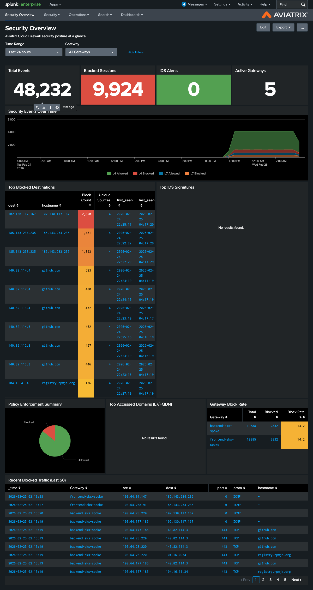
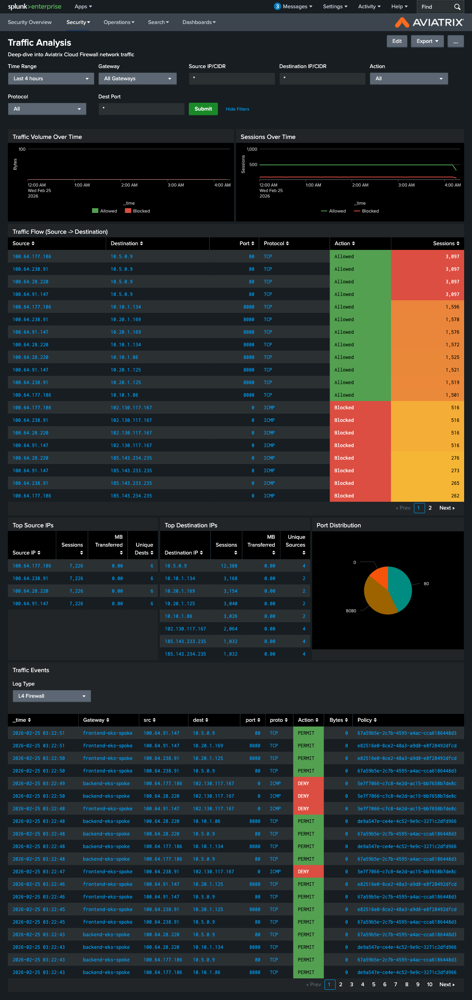
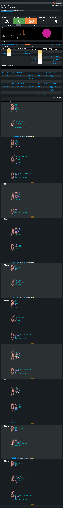

# Aviatrix Splunk Apps

Security visibility and analytics for **Aviatrix Distributed Cloud Firewall** in Splunk. Provides CIM-compliant field extractions and pre-built dashboards for SIEM/SOC teams.

## Screenshots







## Apps

This repository contains two Splunk apps, designed to be installed together:

### TA-aviatrix (Technology Add-on)

Field extractions, lookups, and CIM data normalization for Aviatrix logs ingested via HEC.

**Supported sourcetypes:**

| Sourcetype | Description |
|---|---|
| `aviatrix:firewall:l4` | DCF L4 micro-segmentation logs |
| `aviatrix:firewall:l7` | DCF L7 TLS/SNI inspection logs |
| `aviatrix:firewall:fqdn` | FQDN egress filtering logs |
| `aviatrix:ids` | Suricata IDS alerts (EVE JSON) |
| `aviatrix:gateway:network` | Gateway network statistics |
| `aviatrix:gateway:system` | Gateway CPU/memory/disk statistics |
| `aviatrix:controller:audit` | Controller API audit logs |

**CIM data models:** Network Traffic, Intrusion Detection, Change Analysis

### aviatrix-security (Visualization App)

Pre-built dashboards for monitoring Aviatrix Cloud Firewall activity.

**Dashboards:**

- **Security Overview** -- KPIs, threat timeline, top blocked destinations, gateway block rates
- **Traffic Analysis** -- L4/L7/FQDN traffic patterns, top sources/destinations, protocol breakdown
- **Threat Detection** -- IDS alert severity, signature analysis, source/destination correlation
- **Policy Enforcement** -- L7 policy hits, allow/deny ratios, domain analysis
- **Gateway Health** -- CPU, memory, disk, network throughput per gateway
- **Audit Trail** -- Controller API changes, user activity, success/failure tracking

## Log Ingestion

These apps are designed to work with the [Aviatrix SIEM Connector](https://github.com/AviatrixSystems/aviatrix-siem-connector), which parses Aviatrix Syslog messages and posts them to Splunk via HEC (HTTP Event Collector).

## Requirements

- Splunk Enterprise 8.0+ or Splunk Cloud
- [Aviatrix SIEM Connector](https://github.com/AviatrixSystems/aviatrix-siem-connector) for log ingestion
- CIM Add-on 4.0+ (for data model acceleration)

## Installation

See [DEPLOYMENT.md](DEPLOYMENT.md) for detailed deployment instructions.

**Quick start:**

```bash
# Package the apps
tar -czf TA-aviatrix.tgz TA-aviatrix
tar -czf aviatrix-security.tgz aviatrix-security

# Upload via Splunk Web UI:
# Apps > Manage Apps > Install app from file
# Install TA-aviatrix first, then aviatrix-security
```

## License

Apache License 2.0 -- see [LICENSE](LICENSE).
